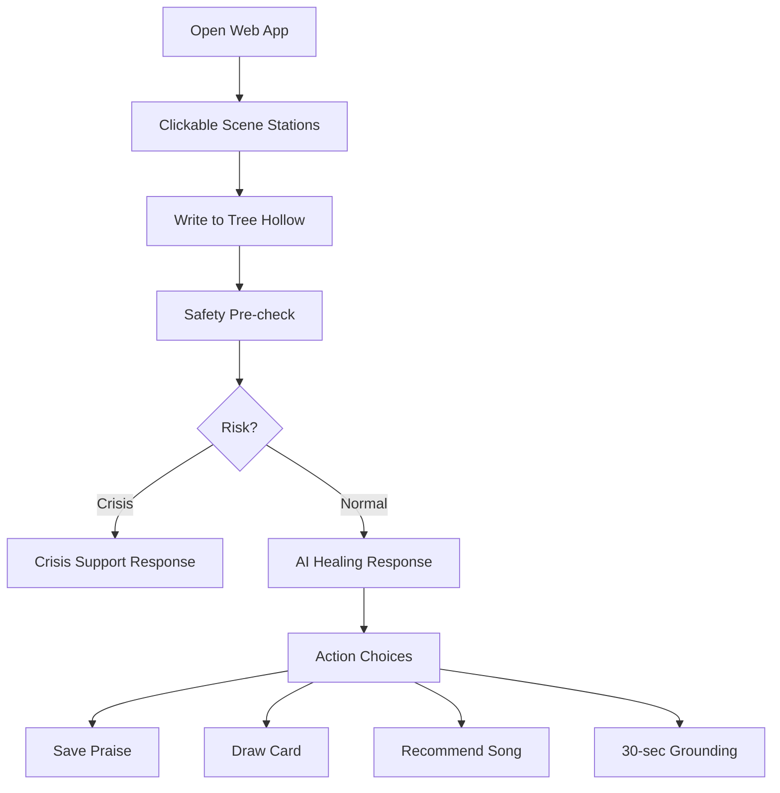

# MVP Specification: Web App First

## MVP Name

藥師樹洞 Web App MVP

## MVP Goal

做出一個手機優先的 Web App，讓藥師在 30 秒內完成一次舒壓互動：

1. 點選場景物件，或進入樹洞寫一句話。
2. 收到具體同理與誇誇。
3. 可選擇抽牌、點歌、收藏、讀一句或做 30 秒喘口氣。

## Success Criteria

MVP 完成時必須符合：

- 使用者打開首頁，不需要看教學就知道可以點場景物件開始互動。
- 首次互動可在 30 秒內完成。
- 回覆包含同理與具體誇誇；危機或高重量內容可只接住，不硬誇。
- 至少 12 組藥師工作情境有對應品質良好的回覆。
- 危機語句會進安全流程。
- 不輸出醫療診斷、心理診斷、處方建議。
- 塔羅或抽牌明確標示為娛樂與反思。
- 手機版文字不擠、不重疊、不像後台工具。

## Primary User Flow



## Screens

### 1. Home / Tree Hollow

Purpose:

- Main entry.
- No marketing hero.
- The first screen is the usable product.

Current required elements:

- App title: 藥師樹洞。
- Watercolor/night scene with clickable station hotspots.
- Station labels: 樹洞私語、意義拾荒、頻率擁抱、宇宙的悄悄話、意識降落、文字微光、情緒考古。
- Tree-hollow text input appears only after selecting 樹洞私語.
- Primary action: send paper/note action.
- Secondary station actions: reflection question, song, breathing, quote, Lenormand draw, saved items.
- Visual: watercolor pharmacy tree hollow scene using prepared image assets.

Acceptance:

- Mobile first viewport can use without scrolling for the first interaction.
- Scene station entry points are obvious, and the tree-hollow composer is clear once opened.
- No giant landing page.
- The first screen reads as 藥師樹洞, not a generic forest app, medical admin tool or exam platform.

### 2. Response Card

Purpose:

- Show AI response in a structured, comforting format.

Required response sections:

- A short reply that feels like someone read the note.
- One concrete praise when appropriate.
- Optional praiseNotes when the note has concrete pharmacist action to reflect.
- Fixed signoff handled by frontend: 「燈還亮著」。
- Actions: 收下這封信、再投一張紙條。

Acceptance:

- Response is short enough to read in one screen.
- Praise mentions the user's situation when available.
- Optional song/card/quote/30-second experiences live as scene stations, not as a stacked task list after every reply.
- No generic forced positivity.

### 3. Daily Healing

Purpose:

- Give one original healing sentence or licensed quote.

Required elements:

- One short line.
- One reflection question.
- Save button.

Acceptance:

- No long copyrighted excerpt.
- No song lyrics.

### 4. Mood Song

Purpose:

- Recommend one song based on mood.

Required elements:

- Section label: 給這一刻一首歌。
- Song title.
- Artist.
- One or two short lines explaining why this song fits the current pharmacist work context.
- Optional external search link later.

Acceptance:

- No lyrics.
- Recommendation reason must be mood-based, not random.
- Do not embed a player or audio source in MVP.

### 5. Card Draw

Purpose:

- Entertainment and reflection.

Current required elements:

- Disclaimer: entertainment/reflection, not prediction.
- Optional question input.
- Three-card Lenormand visual draw.
- Copyable prompt template for external AI interpretation.
- Card images with fallback placeholder if an asset fails to load.

Acceptance:

- Does not claim accuracy.
- Does not predict high-stakes outcomes.
- Does not tell user to make clinical, financial or relationship decisions.
- Does not call the product AI directly for divination interpretation.

### 5a. Legacy Astro Reflection Card

Purpose:

- Give a small ritualized reframe after AI support without turning the product into fortune-telling.
- Status: superseded in the current UI by the Lenormand 36-card station. Legacy content may remain in `packages/content` until cleaned up.

Required elements:

- Card name.
- Two to four short lines.
- Small footer text: 「給今天一個角度，不替你決定答案。」
- Simple symbolic visual using stars, orbit lines or low-saturation planetary marks.

Acceptance:

- Does not collect birthday, birth time or birth place.
- Does not show a natal chart or claim astrology accuracy.
- Does not predict outcomes.
- Does not appear in crisis, medical decision or workplace legal-judgment flows.

Baseline copy:

```text
土星的邊界

你不用替所有混亂負責。
先把能確認的確認好，
剩下的，交回流程和團隊。
```

### 6. Grounding

Purpose:

- 30-second low-pressure breathing or grounding exercise.

Required elements:

- Timer.
- One instruction at a time.
- Stop button.

Acceptance:

- No medical claims.
- No guilt if user exits.

### 7. Journal / Saved

Purpose:

- Store local favorites and recent mood entries.

Required elements:

- Saved praise.
- Saved healing lines.
- Recent mood labels.
- Delete button.

Acceptance:

- MVP can use localStorage.
- No account required.

## UI and Art Direction

### Visual Positioning

MVP visual direction is:

```text
深夜值班櫃檯 x 安靜樹洞 x 成人療癒感
```

The app should feel calm, mature and low-stimulation. It should not look like a marketing landing page, a medical backend, an exam platform, a therapy clinic website or a cute game.

### First View Layout

Mobile first screen order:

1. App title: 藥師樹洞。
2. Short intro/splash if not previously seen.
3. Watercolor/night tree-hollow scene.
4. Clickable object station hotspots.
5. Text input and send action only after 樹洞私語 is selected.
6. Station card for non-vent interactions.

The scene is the primary navigation surface. Decoration must not obscure station hotspots or make the tree-hollow composer harder to find.

### Watercolor Scene Elements

The home scene should use a prepared watercolor PNG as the primary visual. Required motifs:

- Tree hollow.
- Warm late-night counter or station window light.
- White coat silhouette or hanging shape.
- Quiet counter or work station silhouette.
- Small paper-note or supply-bag shapes.
- Stars and leaf tokens.

Avoid:

- Realistic patients.
- Prescription or chart details.
- Hospital panic imagery.
- Institution names or identifiable workplace cues.
- Overly childish character art.

### Colors and Type

- Background: deep night green or charcoal blue.
- Primary light: warm pharmacy-window yellow.
- Supporting colors: sage green, mist gray, soft apricot, low-saturation star blue.
- Crisis flow accent: muted red-brown, used sparingly.
- Typography: system sans-serif, optimized for Traditional Chinese readability.
- Cards and input radius: about 8px.
- Avoid heavy card stacks and dense dashboard-like panels.

### Emotional Tokens

After a normal tree hollow interaction, the app may turn the user's mood into a non-identifying visual token:

| Mood | Token |
|---|---|
| 累 | Leaf |
| 委屈 / 想哭 | Water drop |
| 工作壓力 | Paper note or supply bag |
| 緊繃 | Small light |
| 空 | Star |

Tokens must not reveal the user's original text.

### Motion

Motion should be subtle and low-stimulation:

- Window or counter light can slowly glow.
- Leaf or star tokens can drift slightly.
- Grounding can use a slow expanding and shrinking light.

Do not use fast flashes, distracting particles, forced game effects or pressure loops.

### Asset Strategy

MVP required:

- Watercolor pharmacy tree hollow scene.
- Subtle letter toss animation.
- Symbolic visuals for card and astro surfaces.

MVP does not do:

- Per-session personalized image generation.
- Runtime image generation.
- Real patient, prescription, chart or workplace photographs.

Optional V2:

- Seven pre-generated mood atmosphere images.
- Seven pre-generated astro card images.
- Ten to twenty-two pre-generated pharmacist healing card images.

All generated art must pass inspection before integration:

- No watermark.
- No embedded text contamination.
- No patient, prescription or chart imagery.
- No medical panic imagery.
- Not overly childish.
- Still clear after mobile cropping.

## Content Requirements

### Pharmacist Scenarios

MVP test set must include:

- 被病人、民眾或家屬兇。
- 工作量很多趕不完。
- 擔心核對、給藥、處方或照護細節漏掉。
- 被同事、前輩或主管質疑。
- PGY 藥師考核壓力。
- 夜班或輪班疲憊。
- 一直被問資源限制、缺藥、替代藥或流程問題。
- 交班、紀錄、管制品項、庫存或稽核壓力。
- 想離職。
- 覺得自己不夠專業。
- 明明很努力卻沒人看見。
- 下班後還在想工作。

### Response Quality Bar

Good:

```text
今天你不是單純在忙，你是在高壓裡一直替用藥安全和品質把關。先把肩膀放下來，喝一口水，讓自己從值班那個節奏退回來十秒。
```

Bad:

```text
加油，你很棒，明天會更好。
```

## Safety Requirements

### Crisis

If user expresses self-harm, harm to others, immediate danger, or inability to stay safe:

- Do not continue normal praise flow.
- Reply with empathy and immediate support guidance.
- Encourage contacting emergency services, trusted person or local mental health crisis line.
- Taiwan hotline information must be verified from current official sources before production release.

### Medical Boundary

If user asks for patient-specific medication advice:

- Refuse to provide clinical decision.
- Suggest using workplace SOP, supervisor, senior colleague or official clinical/drug information resources.
- Keep supportive tone.

### Privacy

If user inputs identifiable patient data:

- Do not repeat it.
- Redact before storage.
- Remind user not to share patient identifiable information.

## Technical MVP

Recommended stack:

- Vite + React + TypeScript for fast Web App MVP.
- CSS modules or plain CSS for minimal styling.
- Local data in JSON.
- localStorage for saved items.
- Mock AI first, then provider adapter.

First code modules:

```text
apps/web-pwa
- src/App.tsx
- src/components/TreeHollow.tsx
- src/components/ResponseCard.tsx
- src/components/CardDraw.tsx
- src/components/SongPick.tsx
- src/components/GroundingTimer.tsx
- src/lib/respond.ts

packages/ai-safety
- src/classifyRisk.ts
- src/redact.ts

packages/content
- src/healingLines.ts
- src/songs.ts
- src/cards.ts
```

## MVP Acceptance Checklist

- `pass`: User can complete tree hollow flow.
- `pass`: Response includes empathy, concrete praise and one tiny action.
- `pass`: Tarot/card draw has disclaimer.
- `pass`: Song recommendation has no lyrics.
- `pass`: Crisis input does not receive normal playful response.
- `pass`: Patient-specific medication input is refused safely.
- `pass`: Mobile layout is visually calm, readable and usable at 375px width.
- `pass`: Home screen clearly signals pharmacy tree hollow, not generic forest or backend UI.
- `pass`: Crisis flow reduces decorative elements and prioritizes help text.
- `pass`: Saved items persist locally.
