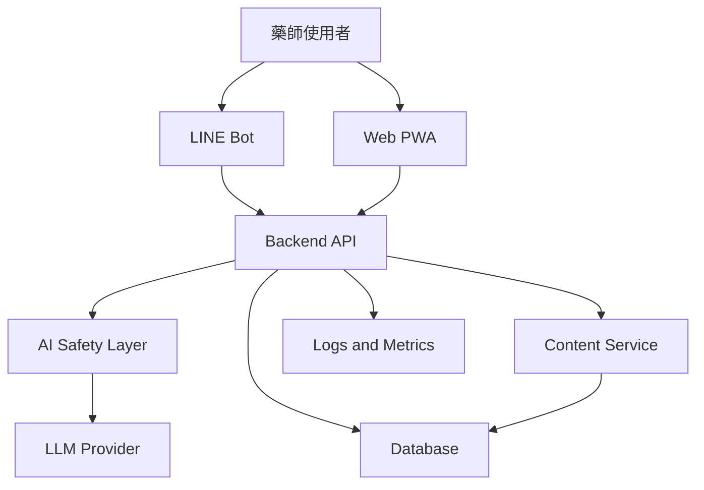

# Software Design Document: 藥師樹洞

## 1. Overview

「藥師樹洞」是一個給藥師使用的舒壓與心理健康支持服務。第一版建議以 Web App 為主要入口，讓使用者用一句話丟出工作壓力、委屈、疲憊或迷惘，系統回覆具體同理、誇誇、小型行動建議，並可延伸到金句、書摘、心情點歌與娛樂型塔羅。

LINE Bot 作為第二入口，用於日常短回合互動。Web App 承擔完整驗收體驗，例如樹洞主畫面、日記回顧、偏好設定、內容庫管理、匿名資料洞察與後台測試。

## 2. Goals

- 讓藥師在工作空檔用 LINE 快速得到情緒支持。
- 產生貼近藥師場景的誇誇與療癒回覆。
- 提供不具診斷性的心情整理工具。
- 提供金句、短書摘、歌單推薦與娛樂型塔羅作為反思入口。
- 建立 AI safety layer，避免醫療、心理健康與個資風險。

## 3. Non-goals

- 不做心理治療或醫療診斷。
- 不處理病人個案、處方判讀或正式用藥建議。
- 不宣稱塔羅、算命或 AI 回覆能準確預測未來。
- 不在第一版做大型社群、公開留言牆或真人諮詢媒合。
- 不收集可識別藥師、院所或病人的敏感資料。

## 4. Target Users

主要使用者：

- 社區藥局藥師：面對客訴、長工時、銷售壓力與民眾溝通。
- 醫院藥師：面對臨床責任、處方審核、跨團隊溝通與輪班。
- PGY 或年輕藥師：面對學習壓力、考核、職涯不確定與自我懷疑。

使用情境：

- 剛被病人或家屬兇完。
- 上班太忙沒有時間好好消化情緒。
- 處方或交互作用確認壓力很大。
- 下班後想被誇一下。
- 想抽一張療癒牌、聽一首歌、看一句話轉換心情。

## 5. Product Surface

### 5.1 Web App

第一版主入口。

核心功能：

- 樹洞首頁。
- 心情 chips。
- 一句話輸入。
- AI 療癒回覆卡。
- 今日療癒。
- 心情點歌。
- 娛樂型抽牌。
- 30 秒喘口氣。
- 收藏與本機日記。

### 5.2 LINE Bot

第二階段日常入口。

核心指令：

- `樹洞`: 使用者輸入事件或心情，AI 給出短回覆。
- `誇誇我`: 根據使用者情境產生具體稱讚。
- `今日療癒`: 回傳每日金句、短書摘或自寫療癒句。
- `點歌`: 根據心情推薦一首歌與推薦理由。
- `抽牌`: 進入娛樂型塔羅或藥師療癒牌。
- `喘口氣`: 啟動 30 秒呼吸或 grounding 練習。

預設回覆結構：

```text
1. 同理一句
2. 具體誇誇一句
3. 一個小步驟
4. 三個 quick replies
```

### 5.3 Web PWA Admin and Review

管理與回顧入口。

功能：

- 心情日記回顧。
- 個人偏好設定，例如語氣、歌單風格、塔羅風格。
- 收藏金句與回覆。
- 內容庫管理。
- 測試 prompt 與 safety rules。

## 6. Architecture



建議技術：

- LINE Bot: Node.js TypeScript, LINE Messaging API。
- Web PWA: Next.js 或 Vite React。
- Backend API: Hono, Fastify 或 Next.js route handlers。
- Database: Postgres for production, SQLite for local MVP。
- Cache: Upstash Redis or in-memory for MVP。
- AI provider: 抽象成 provider interface，避免綁死單一模型。

## 7. Module Responsibilities

### `apps/line-bot`

- 接收 LINE webhook。
- 驗證 signature。
- 將訊息轉成內部 `ConversationInput`。
- 回傳 LINE text message 與 quick replies。

### `apps/web-pwa`

- 提供日記、收藏、偏好設定與內容管理。
- 不承擔核心安全判斷，安全判斷由 backend/package 負責。

### `packages/ai-safety`

- 危機風險分類。
- 個資與病人資料偵測。
- 禁止醫療診斷、法律判斷與心理診斷的 guardrails。
- AI 輸出後檢查。

### `packages/content`

- 金句與自寫療癒句。
- 合法可用的短摘句來源 metadata。
- 歌單推薦資料。
- 塔羅牌義與藥師療癒牌 deck。

### `packages/shared`

- 共用型別。
- 錯誤碼。
- 對話 intent enum。

## 8. AI Flow

1. Normalize input。
2. Classify intent。
3. Run safety pre-check。
4. Retrieve relevant content or card meaning。
5. Generate response with strict response schema。
6. Run safety post-check。
7. Save minimal anonymous interaction metadata if enabled。
8. Return LINE/Web response。

Intent examples：

- `vent`: 樹洞傾聽。
- `praise`: 誇誇。
- `quote`: 金句或書摘。
- `song`: 心情點歌。
- `tarot`: 娛樂型塔羅。
- `grounding`: 呼吸與 grounding。
- `crisis`: 危機資源導引。

## 9. Safety Design

### 9.1 Crisis Handling

觸發條件：

- 使用者提到想死、自傷、傷人、活不下去、立即危險。
- 使用者暗示已有方法、時間、工具或地點。

回覆原則：

- 短句同理。
- 不爭辯、不分析原因、不提供方法細節。
- 鼓勵立即聯絡當地緊急服務、可信任的人或心理衛生資源。
- 若在台灣產品情境，可提供 1925 安心專線、1995 生命線、1980 張老師與 119/110，但上線前需再次查證最新資訊。

### 9.2 Medical and Work Boundary

- 可以說「這聽起來是高壓又需要專業判斷的場景」。
- 不可以說「你應該更改病人的藥」。
- 可以建議「回到院內 SOP、主管或資深藥師討論」。
- 不可以對具體處方做臨床建議。

### 9.3 Tarot and Fortune Telling

產品可提供：

- 固定牌組。
- 可重現的抽牌流程。
- 牌義資料版本管理。
- 情境式反思問題。

產品不可提供：

- 保證準確。
- 預測疾病、死亡、投資、考試必過、感情結果。
- 讓使用者基於占卜做高風險決策。

建議文案：

```text
這是給你整理心情的娛樂型抽牌，不是預測或專業建議。
```

## 10. Data Model

MVP 可先不登入，只保存匿名 session。

```text
UserProfile
- id
- lineUserIdHash
- locale
- tonePreference
- createdAt
- updatedAt

ConversationEvent
- id
- userId
- intent
- riskLevel
- inputRedacted
- outputText
- contentRefs
- createdAt

MoodEntry
- id
- userId
- moodLabel
- intensity
- noteRedacted
- createdAt

ContentItem
- id
- type
- title
- body
- source
- license
- tags
- createdAt
- updatedAt

TarotDraw
- id
- userId
- deckVersion
- spreadType
- cardIds
- interpretation
- createdAt
```

## 11. Privacy

- 儲存前先 redaction。
- 對 LINE user id 做 hash。
- 預設不保存原始敏感文字。
- 提供清除資料機制。
- 後台查詢只看匿名資料與聚合指標。

## 12. MVP Milestones

### M0: Planning

- 完成 AGENTS、SDD、產品規劃與 worktree。

驗收：

- 文件能讓下一位開發者知道產品定位、風險邊界與第一版開發順序。

### M1: Web App MVP

- Mobile-first Web App。
- 樹洞首頁。
- AI 療癒回覆卡。
- `樹洞`, `誇誇我`, `今日療癒`, `點歌`, `抽牌`, `喘口氣`。
- Safety pre-check and post-check。
- localStorage saved items。
- File mock content。

驗收：

- 10 組藥師壓力情境可得到合格回覆。
- 5 組危機語句會進危機流程。
- 5 組病人個資或處方請求會被安全拒答或改導向 SOP。
- 手機畫面可完成完整樹洞互動，不需登入。

### M2: LINE Bot

- LINE webhook。
- Quick replies。
- 將 LINE 輸入串接到同一套 AI、安全與內容模組。

驗收：

- LINE 可以完成樹洞、誇誇、點歌、抽牌與喘口氣。
- Web App 與 LINE Bot 的 safety behavior 一致。

### M3: Web PWA Review and Content Tools

- 日記回顧。
- 收藏。
- 偏好設定。
- 管理內容庫。

驗收：

- 使用者可看到歷史心情標籤與收藏內容。
- 管理者可新增自寫金句與歌單 metadata。

### M4: Pilot

- 小規模藥師封測。
- 收集匿名滿意度與安全問題。
- 修正文案與 prompt。

驗收：

- 封測回饋中未出現重大安全問題。
- 80% 測試者認為回覆「有藥師情境感」。

## 13. Testing Strategy

- Unit tests: intent classifier, redaction, safety rules, content selection。
- Snapshot tests: LINE message payload。
- Safety tests: crisis, medical boundary, privacy。
- E2E tests: LINE webhook mock to backend response。
- Human review: 每次新增 prompt、牌義、歌單、金句需抽樣檢查。

## 14. Open Questions

- 是否要支援匿名登入以外的長期日記保存。
- 是否先做台灣藥師語境，或預留香港/海外中文語境。
- 歌單來源要先用人工 curated list，還是串 Spotify/YouTube Music 搜尋。
- 塔羅用傳統 78 張，或自創「藥師療癒牌」以降低迷信與準確性爭議。
- 危機資源是否只顯示台灣資訊，上線前需以最新官方來源查證。
